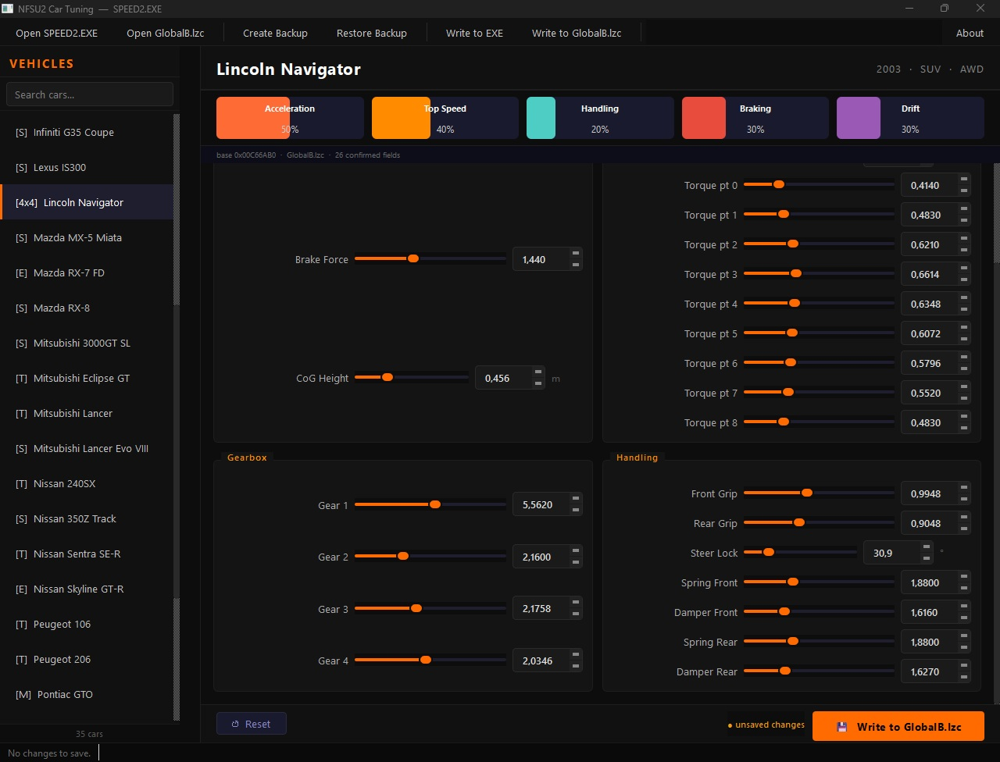

# NFSU2Forge — The Underground 2 Car Physics Editor

> A professional mod tool for **Need for Speed Underground 2** that lets you edit per-car physics directly in `GlobalB.lzc` — no hex editor required.



[](LICENSE)
[]()
[]()
[]()

---

## Features

- **27 confirmed physics fields** per car, all editable via sliders and spinboxes
- **Chassis** — mass, brake force, center of gravity height
- **Engine** — peak RPM, redline, full 9-point torque curve
- **Gearbox** — gear ratios 1–6 (only actual gears shown per car: 4, 5 or 6)
- **Handling** — front/rear grip, steering lock, suspension spring & damping (front + rear)
- **Real-time binary patching** — changes written instantly to memory, saved on demand
- **Auto-backup** — timestamped `.bak` created before every save (no data loss)
- **32 playable cars** supported, all confirmed via binary analysis
- **Performance overview** — visual stat bars (Acceleration, Top Speed, Handling, Braking, Drift)
- **Multi-language UI** — English, Português (BR), Español, Italiano, Français, Русский
- **Dark UI** — clean, modern interface designed for modders

---

## Supported Cars

| Class | Cars |
|-------|------|
| Tuner | 240SX · Civic · Eclipse · RSX · Sentra · Lancer · Tiburon · Audi TT · Audi A3 · Golf GTI · Celica · Focus · Corolla · Peugeot 206 · Peugeot 106 · Corsa |
| Sport | 350Z · 3000GT · G35 · IS300 · RX-8 · Miata · RX-7 · Skyline · Supra |
| Muscle | Mustang GT · GTO |
| Exotic | Impreza WRX · Lancer Evo 8 |
| SUV | Escalade · Hummer · Navigator |

> **Note:** LANCER and LANCER EVO 8 share a physics block in the binary — editing one edits the other.

---

## Requirements

| | |
|---|---|
| **OS** | Windows 10 / 11 (64-bit) |
| **Game** | Need for Speed Underground 2 (PC) |
| **File** | `GlobalB.lzc` from your NFSU2 installation |

> The standalone `.exe` download requires **no Python installation**.

---

## Download

**[⬇ Download latest release](../../releases/latest)**

Extract the zip and run `NFSU2Forge.exe`. No installation required.

---

## How to Use

### ⚠️ Step 0 — Backup your files first!

Before doing anything, **manually copy `GlobalB.lzc` somewhere safe**.
NFSU2Forge creates automatic backups on every save, but a manual copy is always the safest insurance.

Your `GlobalB.lzc` is located in your NFSU2 install folder:
```
<NFSU2 folder>\GLOBAL\GlobalB.lzc
```
Default Steam path:
```
C:\Program Files (x86)\Steam\steamapps\common\Need For Speed Underground 2\GLOBAL\GlobalB.lzc
```

### Step 1 — Open GlobalB.lzc

1. Launch **NFSU2Forge.exe**
2. Click **"Open GlobalB.lzc"** in the toolbar
3. Navigate to your NFSU2 `GLOBAL\` folder and select the file

### Step 2 — Select a car

Click any car in the left sidebar to load its physics data. Use the search box to filter by name or class.

### Step 3 — Edit parameters

Adjust sliders or type values directly into the fields:

| Section | Fields |
|---------|--------|
| **Chassis** | Mass (tonnes), Brake Force, Center of Gravity height |
| **Engine** | Peak RPM, Redline, Torque curve (9 points) |
| **Gearbox** | Gear ratios 1–6 — only slots available for the car are shown |
| **Handling** | Front/Rear grip, Steering lock, Suspension spring & damping |

> Changes are applied to memory instantly. Nothing touches the file until you click **Write**.

### Step 4 — Save

Click **Write to GlobalB.lzc**.
An automatic timestamped backup is created before every write.

### Step 5 — Test in game

Launch NFSU2 and feel the difference.

---

## Backup & Restore

Every write creates an automatic backup next to your file:
```
GlobalB.lzc.bak_20250405_143022
```
To restore: rename the `.bak` file back to `GlobalB.lzc`.

---

## Language Support

Change the UI language using the selector in the toolbar. Available languages:

| Code | Language |
|------|----------|
| EN | English |
| PT-BR | Português (Brasil) |
| ES | Español |
| IT | Italiano |
| FR | Français |
| RU | Русский |

The selected language is saved automatically between sessions.

---

## Building from Source

Requires **Python 3.11+**:

```bash
git clone https://github.com/justlucasgomes/NFSU2Forge.git
cd NFSU2Forge
pip install -r requirements.txt
python main.py
```

To build a standalone `.exe`, see [BUILD.md](BUILD.md).

---

## Contributing

Pull requests are welcome. Open an issue first for major changes.

Areas where contributions are especially valuable:
- Confirming additional binary offsets for more physics fields
- Adding support for more cars or NFSU2 language variants
- Testing on different NFSU2 builds (original disc, Steam, etc.)

---

## Legal

- This tool does **not** include any files from Need for Speed Underground 2.
- You must own a legitimate copy of the game to use this tool.
- "Need for Speed Underground 2" is a trademark of Electronic Arts Inc.
- This project is not affiliated with, endorsed by, or connected to EA in any way.
- Use at your own risk. Always back up your game files before modding.

---

## License

[MIT](LICENSE) — free to use, modify, and distribute.
